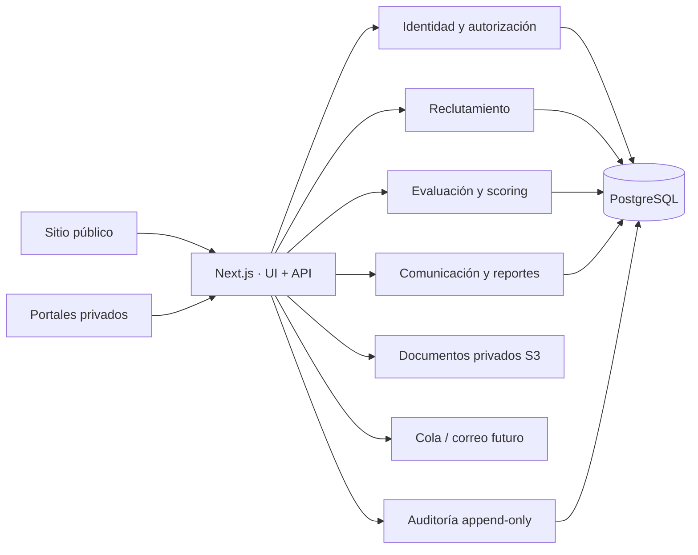
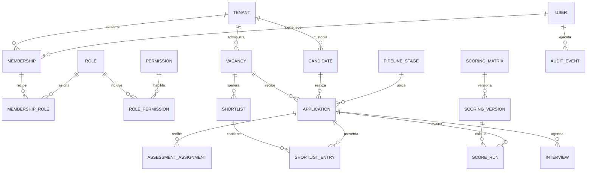

# Diseño funcional y técnico — Talento SV

## 1. Alcance y actores

Talento SV gestionará de punta a punta solicitudes, vacantes, expedientes, postulaciones, entrevistas, evaluaciones, scoring versionado, rankings, ternas, decisiones y reportes. El sitio público captará clientes y candidatos; la plataforma privada atenderá superadministradores, administradores, reclutadores, psicólogos, clientes y candidatos.

Reglas invariantes: todo acceso privado se autoriza en servidor; un cliente nunca consulta datos de otro; un candidato solo se presenta cuando existe autorización explícita; notas internas y compartidas son tipos distintos; scoring y auditoría son inmutables/versionados; la decisión de contratación siempre es humana.

## 2. Arquitectura propuesta

Se adopta inicialmente un **monolito modular** con Next.js App Router y TypeScript estricto, PostgreSQL, Prisma, Zod, Auth.js, Tailwind y almacenamiento S3-compatible. Es la opción de menor complejidad operativa y permite transacciones consistentes. Cada dominio mantiene puertos e interfaces para extraerse más adelante si el volumen lo exige.

Capas por módulo: `domain` (reglas y entidades), `application` (casos de uso), `infrastructure` (Prisma, correo, S3), `presentation` (rutas y UI). Las rutas nunca acceden directamente a Prisma: invocan casos de uso con contexto de identidad y empresa.



## 3. Módulos

- Identidad: usuarios, credenciales, sesiones, recuperación, invitaciones y accesos.
- Tenancy y administración: empresas, membresías, planes y configuración regional.
- Autorización: roles configurables, permisos granulares y políticas contextuales.
- Reclutamiento: solicitudes, vacantes, etapas configurables, tareas y responsables.
- Candidatos: expediente, consentimientos, documentos, deduplicación y postulaciones.
- Entrevistas: agenda, formularios, competencias, asistencia y calificación.
- Evaluaciones: instrumentos autorizados, versiones, asignaciones, respuestas e informes.
- Scoring: matrices/versiones, variables, reglas, ejecuciones explicables e inmutables.
- Ternas: ranking, inclusión humana, presentación, comparación y decisión.
- Comunicación: notas internas/cliente, adjuntos, plantillas y notificaciones.
- Documentos: metadatos, análisis de tipo/tamaño, permisos y URL firmada.
- Reportes: indicadores operativos y ejecutivos.
- Auditoría: eventos inmutables, acceso sensible y trazabilidad.
- Sitio público: contenido, formularios, vacantes, SEO y protección anti-spam.

## 4. Modelo entidad-relación inicial



## 5. Catálogo de tablas previsto

Fase 1 incluye `tenants`, `users`, `memberships`, `roles`, `permissions`, `role_permissions`, `membership_roles`, `pipeline_stages`, `vacancies`, `candidates`, `applications` y `audit_events` como núcleo verificable.

Fases siguientes agregan: `credentials`, `sessions`, `password_reset_tokens`, `login_attempts`, `invitations`, `tenant_settings`, `recruitment_requests`, `vacancy_assignments`, `vacancy_status_history`, `candidate_profiles`, `experiences`, `educations`, `certifications`, `languages`, `references`, `tags`, `candidate_tags`, `documents`, `document_grants`, `consents`, `consent_versions`, `interviews`, `interview_forms`, `interview_responses`, `assessment_types`, `assessment_versions`, `question_banks`, `questions`, `assessment_assignments`, `assessment_responses`, `assessment_results`, `professional_interpretations`, `scoring_matrices`, `scoring_versions`, `scoring_variables`, `scoring_rules`, `score_runs`, `score_components`, `shortlists`, `shortlist_entries`, `client_decisions`, `comments`, `notifications`, `email_templates`, `tasks` y `outbox_events`.

Relaciones sensibles se anclan a `tenant_id`; postulaciones enlazan candidato y vacante; documentos tienen propietario y concesiones explícitas; toda ejecución de scoring referencia una versión congelada; la terna referencia postulaciones, no copias ambiguas de candidatos.

## 6. Estrategia multiempresa

El contexto autenticado resuelve `user_id`, `membership_id`, `tenant_id` y permisos. Los repositorios exigen el `tenant_id` como argumento, filtran cada consulta y validan que todas las entidades relacionadas pertenezcan al alcance permitido. Los UUID públicos evitan exponer claves secuenciales. Restricciones e índices compuestos refuerzan aislamiento y unicidad.

Para clientes, el alcance adicional exige `vacancy.client_tenant_id = tenant_id` y `application.presented_to_client_at IS NOT NULL`. Los documentos requieren una concesión vigente. PostgreSQL Row-Level Security se evaluará como defensa adicional antes de producción; no reemplaza las políticas de aplicación. Las pruebas automatizadas intentarán accesos cruzados en cada repositorio y endpoint.

## 7. Matriz inicial de roles y permisos

| Capacidad | Superadmin | Admin reclutadora | Reclutador | Psicólogo | Cliente | Candidato |
|---|---:|---:|---:|---:|---:|---:|
| Plataforma/planes | Total | No | No | No | No | No |
| Empresas y usuarios | Total | Total en alcance | Lectura limitada | No | Usuarios propios | Perfil propio |
| Vacantes | Total | Total | Gestionar asignadas | Lectura asignada | Leer/solicitar propias | Leer públicas |
| Candidatos | Total | Total | Gestionar en alcance | Evaluar asignados | Solo presentados | Perfil propio |
| Evaluaciones | Total | Configurar | Asignar/leer permitido | Gestionar/interpretar | Resumen autorizado | Completar propias |
| Scoring/ternas | Total | Configurar/publicar | Ejecutar/proponer | Aportar resultados | Decidir sobre presentados | No |
| Auditoría | Total | Leer en alcance | No | No | Historial propio permitido | No |

Los roles son plantillas; la autorización real usa códigos de permiso y políticas de recurso. Separación recomendada: quien configura una matriz no publica su propia versión sin revisión cuando el cliente requiera doble control.

## 8. Flujos principales

1. Cliente crea solicitud → reclutadora revisa → valida perfil → crea/publica vacante.
2. Candidato acepta consentimiento → completa expediente → postula → deduplicación asistida.
3. Reclutador filtra → entrevista → psicólogo evalúa → referencias → scoring versionado.
4. Equipo revisa ranking → selecciona terna con motivo → autoriza campos/documentos → publica al cliente.
5. Cliente compara → comenta/solicita entrevista → aprueba o rechaza con motivo → selección y cierre.
6. Cada transición produce historial, notificación y evento de auditoría; las operaciones asíncronas usan patrón outbox.

## 9. Seguridad

- Contraseñas con Argon2id; cookies de sesión `HttpOnly`, `Secure`, `SameSite=Lax`; rotación y revocación por dispositivo.
- Retardo y bloqueo temporal progresivo, rate limiting distribuible y registros de acceso.
- CSRF en mutaciones, CSP y encabezados seguros; React escapa salida y se sanitiza contenido enriquecido.
- Zod en límites de entrada; Prisma parametriza consultas; autorización antes de cargar el recurso.
- Documentos privados con validación de firma MIME/contenido, antivirus futuro, cifrado del proveedor y URLs breves firmadas.
- Secretos solo por variables/gestor de secretos; bitácora append-only con acceso restringido y retención definida.
- Copias cifradas, restauración ensayada, RPO/RTO definidos y monitoreo de eventos críticos.

## 10. Estructura de carpetas

```text
src/
  app/                         rutas, layouts y endpoints
  modules/<dominio>/
    domain/                    reglas puras
    application/               casos de uso y puertos
    infrastructure/            Prisma, S3, correo
    presentation/              DTO, controladores, UI
  shared/
    domain/ infrastructure/ presentation/
prisma/                        esquema, migraciones y seed
docs/                          arquitectura, decisiones y cumplimiento
```

## 11. Decisiones y justificación

- Monolito modular: entrega rápida, transacciones simples y límites que permiten extracción futura.
- Next.js full-stack: un solo lenguaje y despliegue inicial; los casos de uso no dependen del framework.
- PostgreSQL/Prisma: consistencia relacional, índices, JSON solo cuando aporta flexibilidad y migraciones revisables.
- UUID público + bigint interno: URLs no enumerables y joins eficientes.
- Auth.js con credenciales propias: control de invitación, sesión y políticas; Argon2 se incorpora en Fase 2.
- Versionado inmutable: reproduce scoring, evaluaciones, consentimientos y textos legales.
- Outbox: evita perder notificaciones cuando una transacción de negocio ya confirmó.

## 12. Riesgos técnicos y mitigación

| Riesgo | Mitigación |
|---|---|
| Fuga entre empresas | Contexto obligatorio, repositorios con alcance, pruebas negativas y posible RLS |
| Scoring incorrecto o sesgado | DSL limitada, validación, datasets dorados, explicación y aprobación humana |
| Crecimiento del expediente/documentos | S3, metadatos en DB, límites, lifecycle y antivirus |
| Auditoría con datos excesivos | Lista permitida, redacción de secretos, retención y acceso mínimo |
| Notificaciones duplicadas/perdidas | Outbox, idempotencia y reintentos |
| Dependencia de instrumentos propietarios | Registro de licencia/versiones; no precargar pruebas protegidas |
| Complejidad de permisos | Catálogo estable, políticas testeadas y simulador administrativo futuro |

## 13. Plan por fases y criterios de salida

1. **Fundación:** proyecto, configuración, PostgreSQL, Prisma, Docker, esquema núcleo, seed y documentación. Sale con generación Prisma, typecheck y build exitosos.
2. **Identidad y control:** autenticación, sesiones, invitaciones, usuarios, empresas, RBAC/políticas y auditoría. Sale con pruebas de permisos y aislamiento.
3. **Presencia pública:** páginas, vacantes, contacto, cotización, solicitudes y CV con anti-spam. Sale con accesibilidad/SEO y pruebas de formularios.
4. **Operación:** solicitudes, vacantes, candidatos, etapas, entrevistas y documentos. Sale con flujo completo y trazabilidad.
5. **Evaluación:** motor versionado, scoring explicable, ranking y terna. Sale con pruebas de cálculo y reproducción histórica.
6. **Portal cliente:** dashboard, presentación controlada, comparación, comentarios, decisiones e informes. Sale con pruebas exhaustivas de acceso horizontal.
7. **Producción:** notificaciones, reportes, indicadores, hardening, respaldo/restauración, rendimiento, observabilidad y pruebas E2E.

No se inicia una fase si la anterior no compila o conserva errores críticos. Cada fase se divide en cambios pequeños, migraciones reversibles y demostraciones de aceptación.

## 14. Validación legal requerida en El Salvador

> **REVISIÓN LEGAL OBLIGATORIA:** abogado laboral salvadoreño debe validar formularios, criterios de selección, conservación de expedientes, verificaciones de referencias, comunicaciones de rechazo, contratación y cualquier dato exigido/prohibido por normativa laboral.

> **REVISIÓN DE PRIVACIDAD OBLIGATORIA:** profesional local debe validar base jurídica, responsables/encargados, consentimientos, avisos y versiones, finalidades, transferencias a clientes/proveedores, revocación, derechos del titular, incidentes, exportación, retención, anonimización y transferencias internacionales.

También requieren dictamen: tratamiento de DUI u otros identificadores, fotografía, referencias, aspiración salarial, resultados psicométricos, datos sensibles, monitoreo de accesos, cookies, firma/aceptación electrónica y ubicación de respaldos. La plataforma registrará texto/version/fecha/medio/finalidad, pero la configuración aprobada será responsabilidad de la organización. No se usarán atributos protegidos o irrelevantes en scoring; se requerirán revisiones de impacto y sesgo.
